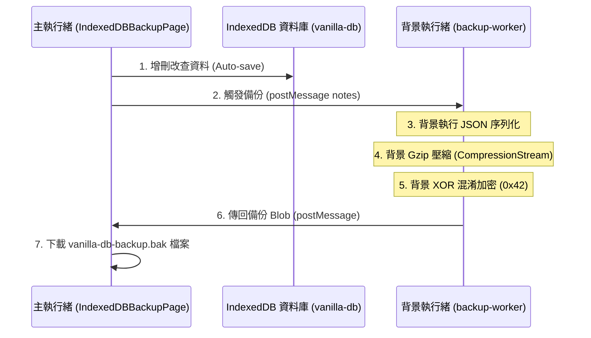

# 🧪 IndexedDB 離線資料庫與 Worker 背景備份技術手冊

本篇文檔介紹了如何在不使用第三方資料庫套件的環境下，操作瀏覽器原生 **IndexedDB** 管理大量結構化資料，並結合 **Web Worker**、**Compression Streams API** 與 **位元混淆 (XOR)**，實作高效且不阻塞主執行緒的背景資料備份與還原系統。

---

## 🏗️ 1. 技術架構圖

本實驗室採用三層分離架構：



---

## ⚙️ 2. IndexedDB 原生封裝 (`lib/db-service.js`)

IndexedDB 是非關係型 (NoSQL) 的客戶端資料庫，操作皆為非同步事件回呼。
本專案透過 `Promise` 將其進行現代化封裝，提供極簡的資料操作介面：

```javascript
import { BaseService } from './base-service.js';

export class DBService extends BaseService {
    // 惰性載入資料庫連線
    async _getDB() {
        if (this._db) return this._db;
        return new Promise((resolve, reject) => {
            const request = indexedDB.open('vanilla-db', 1);
            request.onsuccess = () => resolve(request.result);
            request.onupgradeneeded = () => {
                request.result.createObjectStore('notes', { keyPath: 'id' });
            };
        });
    }

    // 讀取
    async getAll() {
        const db = await this._getDB();
        return new Promise((resolve, reject) => {
            const tx = db.transaction('notes', 'readonly');
            const req = tx.objectStore('notes').getAll();
            req.onsuccess = () => resolve(req.result);
        });
    }
    
    // 更新並觸發反應式重繪事件
    async put(note) {
        const db = await this._getDB();
        return new Promise((resolve, reject) => {
            const tx = db.transaction('notes', 'readwrite');
            tx.objectStore('notes').put(note);
            tx.oncomplete = () => {
                this.emit('change'); // 廣播資料已變更
                resolve(note);
            };
        });
    }
}
```

---

## 🧵 3. Web Worker 背景備份機制 (`lib/backup-worker.js`)

當資料量非常龐大（例如數百筆大文章）時，執行 `JSON.stringify` 序列化與資料壓縮會佔用大量 CPU 時間，這在單執行緒的瀏覽器中會造成 UI 掉幀、按鈕卡頓。

我們將這段計算工作外包給 **Web Worker**：

### 3.1 啟用背景執行緒
```javascript
const worker = new Worker('./lib/backup-worker.js');
worker.postMessage({ action: 'backup', payload: this.state.notes });
```

### 3.2 Worker 背景 Gzip 壓縮與加密 (XOR)
在背景 Worker 執行緒中，我們使用瀏覽器前沿的 **`CompressionStream` API** 進行流式 (Stream) 壓縮，並執行位元異或 (`^ 0x42`) 完成混淆加密：

```javascript
// backup-worker.js
self.onmessage = async (e) => {
    const { payload } = e.data;
    const dataStr = JSON.stringify(payload);
    const bytes = new TextEncoder().encode(dataStr);
    
    // Gzip 壓縮
    const stream = new ReadableStream({
        start(c) { c.enqueue(bytes); c.close(); }
    }).pipeThrough(new CompressionStream('gzip'));
    
    // 將 Stream 轉為 Blob (利用同步的 FileReaderSync)
    const compressedBlob = new Blob(chunks, { type: 'application/gzip' });
    const reader = new FileReaderSync();
    const arrayBuffer = reader.readAsArrayBuffer(compressedBlob);
    
    // 位元加密混淆 (與 0x42 執行 XOR)
    const encrypted = new Uint8Array(arrayBuffer.byteLength);
    const view = new DataView(arrayBuffer);
    for (let i = 0; i < arrayBuffer.byteLength; i++) {
        encrypted[i] = view.getUint8(i) ^ 0x42;
    }
    
    self.postMessage({ status: 'success', blob: new Blob([encrypted]) });
};
```

---

## 🔄 4. 匯入還原：解鎖與解壓流 (DecompressionStream)

還原備份檔案時，主執行緒會逆向執行該流程：
1. **讀取檔案**：以 `ArrayBuffer` 載入 `.bak` 備份檔。
2. **XOR 解密**：再次對每個位元進行 `^ 0x42` 操作（XOR 的特性：二次 XOR 可還原原始數值）。
3. **Gzip 解密壓縮**：使用 **`DecompressionStream('gzip')`** 還原為純文字 JSON 字串。
4. **載入資料庫**：解析 JSON 並批次 `put` 寫入 IndexedDB。

```javascript
// 還原代碼片段
const decrypted = arrayBufferBytes.map(b => b ^ 0x42);
const stream = new ReadableStream({
    start(c) { c.enqueue(decrypted); c.close(); }
}).pipeThrough(new DecompressionStream('gzip'));

const jsonStr = await new Response(stream).text();
const notes = JSON.parse(jsonStr);
```

---

## 🎓 5. 學習重點與安全建議

1. **防抖存檔 (Debounce)**：UI 編輯區應採用 500ms 左右的防抖，避免每次打字都寫入資料庫，以提昇效能。
2. **XOR 限度**：異或 (XOR) 加密僅能預防「純文字明文外洩」，防禦層級極低。若在生產環境需要儲存高度機密資料，建議結合瀏覽器原生的 **Web Crypto API** (如 `crypto.subtle.encrypt` 使用 AES-GCM 算法)。
3. **生命周期回收**：當 `connectedCallback` 訂閱了 `dbService.on('change')` 時，必須在 `disconnectedCallback` 中精確執行 `off('change')`，否則當組件被銷毀時，監聽器會繼續佔用記憶體，導致嚴重的 **記憶體洩漏 (Memory Leak)**。
